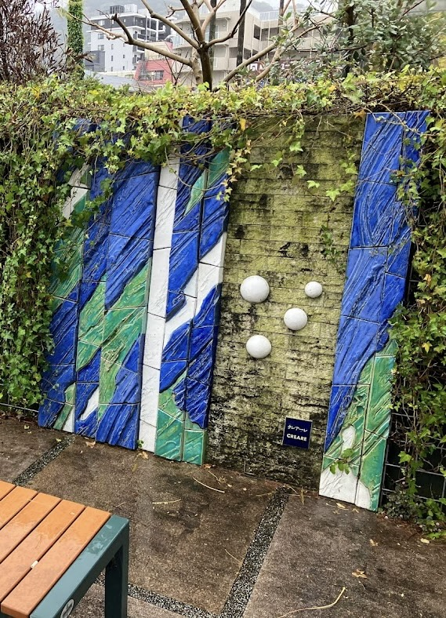

### 問題

海が綺麗なこの日本の街は、かつてポルトガルのリゾート地との交流がありました。
この写真のすぐ右側にはその記念碑が置かれています。記念碑に書かれている「式典の開催日」を答えてください。
Format: TsukuCTF25{YYYY/MM/DD}

 

### 解法
画像検索したら
熱海市とポルトガルのカスカイス市との国際交流を記念したことに関連があることがわかった。

姉妹都市の提携が1990年7月2日だったが、違った。
他の式典を探したら次の広報誌が見つかりました。

[広報あたみ No.689 ７月 10日発行](https://www.city.atami.lg.jp/_res/projects/default_project/_page_/001/001/436/2560item_file.pdf)

```text
新たな熱海の花の名所としてお宮緑地を中心に平成26年６月６日に「ジャカランダ遊歩道」がオープンしました。
完成記念式典はあいにくの雨だったものの、篤志家である(株)大塚商会の大塚実名誉会長、
ジョゼ・デ・フレイタス・フェラース駐日ポルトガル大使をはじめとして、多くの関係者が一堂に介し、新たな花の名所の誕生を祝いました。
```

`TsukuCTF25{2014/06/06}`