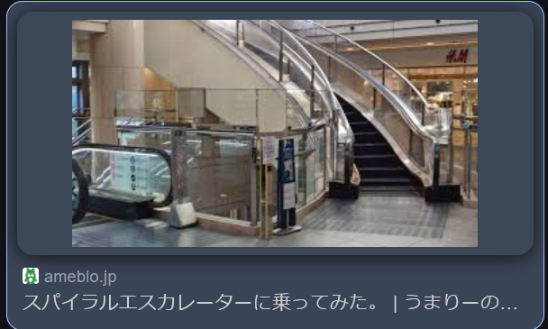

### 問題
これは日本の有名な場所の一部です。あなたはこの写真の違和感に気づけますか？
フラグはこの場所のWebサイトのドメインです。
例: `TsukuCTF25{example.com}`

Google Lensで調べると、どうやらスパイラルエスカレーターという珍しいエスカレーターらしい

スパイラルエスカレーターで検索して画像を漁っていると・・・

エスカレーターの警告表示(?)が似ている

https://ameblo.jp/umaleeno/entry-12876405935.html

「ランドマークタワー」という場所らしい

https://www.yokohama-landmark.jp/

`TsukuCTF25{www.yokohama-landmark.jp}`