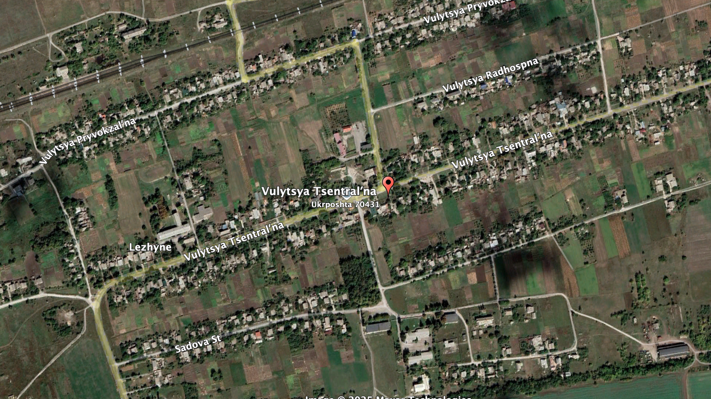
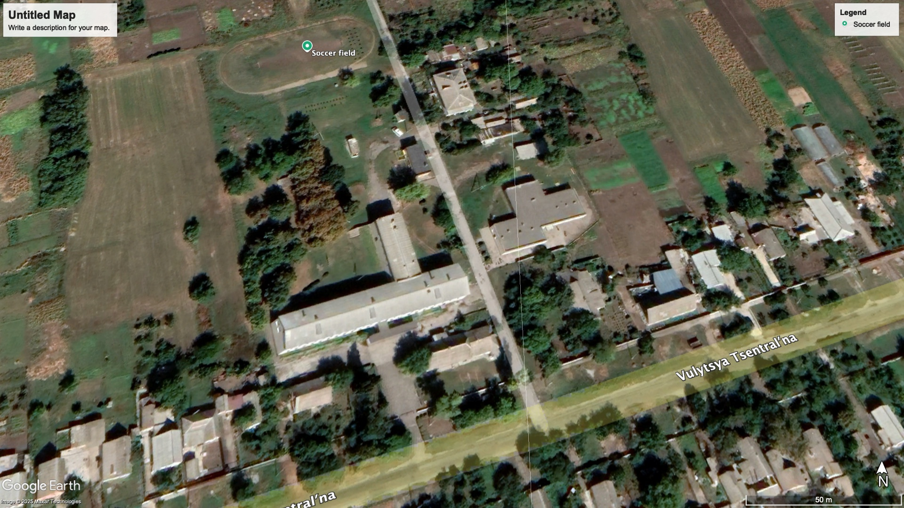

### 問題

この[Telegramの投稿](https://t.me/etozp/19319)の写真に写っている学校を特定してください。
フラグフォーマットはその場所の座標の小数点第4位を四捨五入して、小数第3位までをTsukuCTF25{緯度_経度}の形式で記載してください。
例: TsukuCTF25{12.345_123.456}
注意: この問題を解く過程で、戦争に関わる直接的な画像が表示される場合があります。

23:14 GMT+9 追記: フラグを追加しました

### 解法

Telegramの投稿にある画像を使って画像検索をすると2022年12月24日にウクライナのザポリージャ郊外にミサイル攻撃を受けた記事が出てくる。
[2022年12月24日、ザポリジジでロシア軍がステプネンコミュニティの体育館に発砲しました](https://fakty.com.ua/ua/proisshestvija/20221224-rf-vdaryla-raketamy-po-peredmistyu-zaporizhzhya-zrujnovano-budivlyu-gimnaziyi/)

記事をみると
- ステプネンコミュニティ (Степненська громада)
- ギムナジウム (гімназія) 
- レジネ村 (село Лежине)

レジネ村のギムナジウムを調べれば良いことがわかったのでGoogle検索すると、次のような学校のデータベースが得られた。

[Лежинська гімназія Степненської сільської ради Запорізького району Запорізької області | Реєстр суб'єктів освітньої діяльності](https://registry.edbo.gov.ua/institution/136157/)

住所は `с. Лежине, Запорізький р-н, Запорізька обл., вулиця Центральна, 19` らしい。この住所は通りの名前しか示していないそうなので、衛星画像から学校っぽい建物を調べる。

サッカーコートの付近に大きな建物があった。入口があるところや、建物がT字になっているあたりなどニュースやTelegramの投稿とマッチしたので確定した。

全く通らないと思って試行錯誤していたが、どうやら問題に誤ったフラグが設定されていたらしく再提出で正解した。

検索によく出てくるようなニュースだったため、サクサク情報が出てきた印象がある。

`TsukuCTF25{47.807_35.358}`

