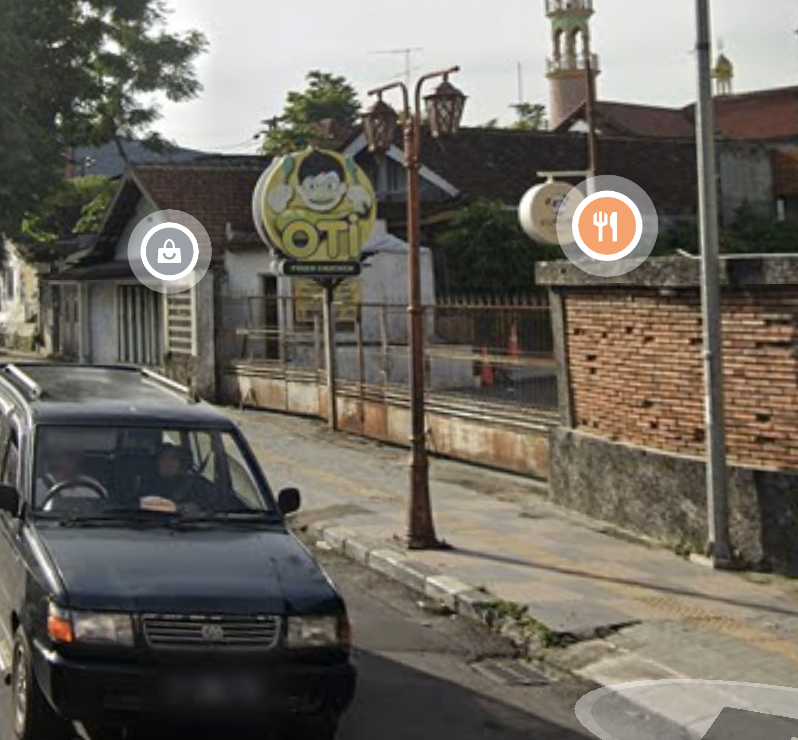

### 問題

遠くまで歩き、夕闇に消える足跡
煌めく街頭が、夜の街を飾る
傍らの道には、バイクの群れが過ぎ去り
風の音だけが残る

光と影の中、ふと立ち止まり思う
私は今、どこにいるんだろう

フラグフォーマットはこの人が立っている場所のTsukuCTF25{緯度_経度}です。ただし、緯度および経度は小数点以下五桁目を切り捨てたものとします。

### 解法

雰囲気が東南アジアで左側通行なのでマレーシアとかインドネシア？っぽいなと思った。

画像検索したりChatGPTに聞いてもわからなかったのでランドマークを探してみた。右側にある `OTI FRIED CHIKEN` がきになる。
調べると、インドネシアにあるOTI Fried Chikenというチェーン店で30店舗くらいあることがわかった。

[Kunjungi Kami - OTI Fried Chicken](https://otifriedchicken.com/kunjungi-kami/)

全店舗のストリートビューを見て `OTI Fried Chicken Salatiga` だとわかった。見覚えのある街灯と歩道もあった。

`TsukuCTF25{-7.3188_110.4970}`

OSINTの良い入門no
mondai 
だと思う。