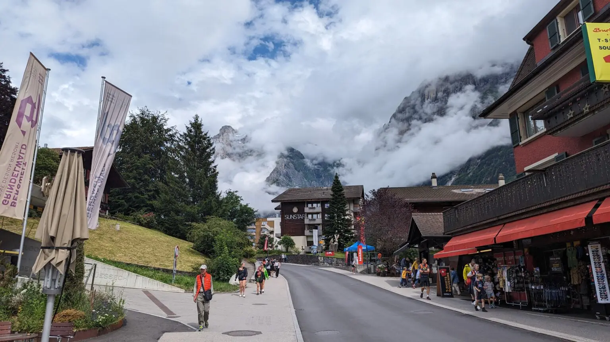
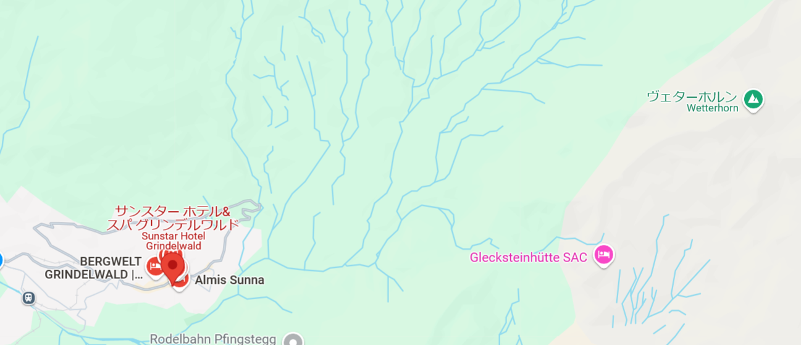
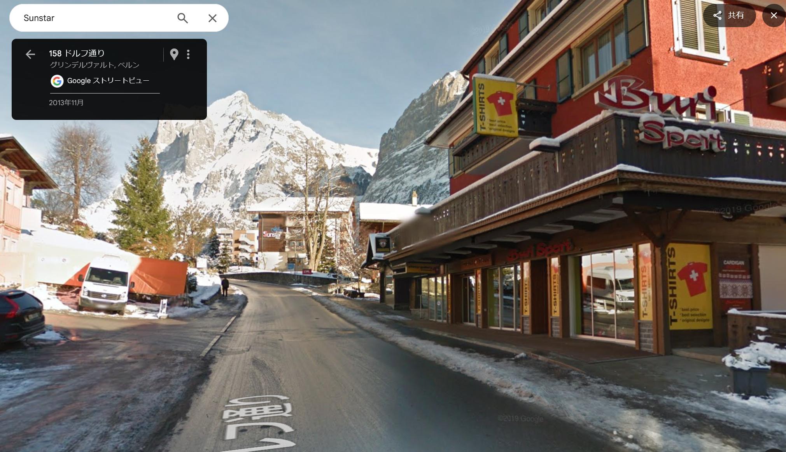

### 問題
素敵な雪山に辿り着いた！スノーボードをレンタルをして、いざ滑走！
フラグフォーマットは写真の場所の座標の小数点第4位を四捨五入して、小数第3位までを`TsukuCTF25{緯度_経度}`の形式で記載してください。
例: `TsukuCTF25{12.345_123.456}`

### 解法
とりあえずGoogle Lensで調べると、どうやらスイスのグリンデルワルトという場所らしい。

https://niyodogawa.org/blog/outdoor/car/etc/64737/

ヴェターホルン（Wetterhorn）という山らしい

写真と同じと思われる建物が右側に見える。
奥には`SUNSTAR`と書いてある。

これを手がかりにして、Google Mapsで調べる。

サンスターホテルはすぐに見つかった。

ヴェターホルンが右にあるということは、写真の場所は地図のやや左だろうか。

一発でピッタリの場所が見つかった。

https://maps.app.goo.gl/4hppwGfJm2jzwrTg9

46.6235636,8.0399819

`TsukuCTF25{46.624_8.040}`