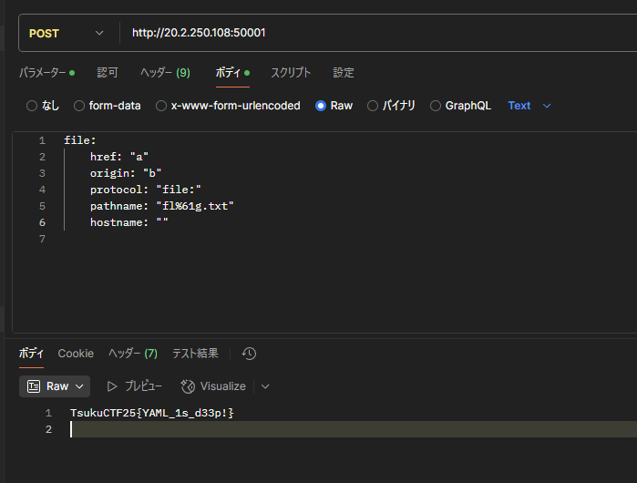

### 問題
YAML is awesome!!

### 解法

```js title=server.js {"1":11-17} {"2":19-24}
const express = require('express');
const bodyParser = require('body-parser');
const fs = require('fs');
const path = require('path');
const yaml = require('js-yaml');
const app = express();
app.use(bodyParser.text());

app.post('/', (req, res) => {
  try {
    if (req.body.includes('flag')) {
      return res.status(403).send('Not allowed!');
    }
    if (req.body.includes('\\') || req.body.includes('/')
      || req.body.includes('!!') || req.body.includes('<')) {
      return res.status(403).send('Hello, Hacker :)');
    }

    const data = yaml.load(req.body);
    const filePath = data.file;

    if (filePath && fs.existsSync(filePath)) {
      const content = fs.readFileSync(filePath, 'utf8');
      return res.send(content);
    } else {
      return res.status(404).send('File not found');
    }
  } catch (err) {
    return res.status(400).send('Invalid request');
  }
});

app.listen(3000, () => {
  console.log('Server listening on port 3000');
});
```

`server.js`を見るとファイルの中身を返してくれるサーバーだということがわかる。
入力にはいくつか制限がある
- `flag`を含められない
- `\`,`/`,`!!`,`<`を含められない
`\`が使えないので`\u0000`や`\x000`みたいなものは使えない。

では、YAMLの仕様を使い`flag`と書く方法があるのかと思い調べたがうまく見つけられなかった。

次に、`readFileSync`を疑う。`file://`みたいなのを使ってバイパスできないだろうか。

`readFileSync`でいろいろ調べてみる。

あ・・・・

https://nanimokangaeteinai.hateblo.jp/entry/2022/08/09/022238#Web-209-simplewaf-28-solves

ほぼ同じ状況だ・・・



`TsukuCTF25{YAML_1s_d33p!}`