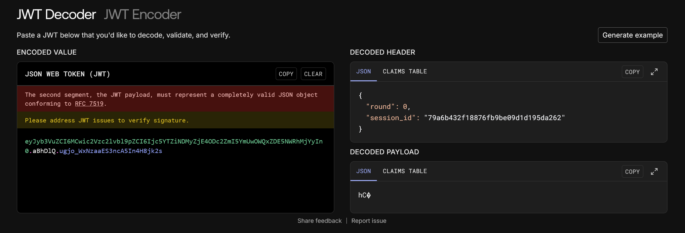
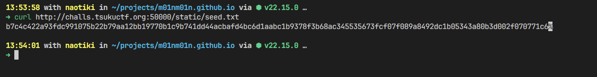
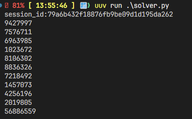
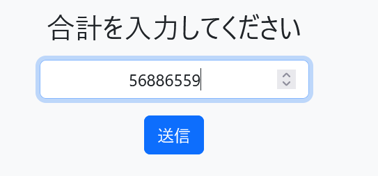
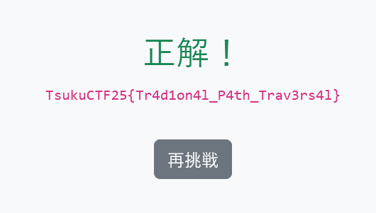

---
# ../../のフォルダ名
contest: 202505_tsukuctf2025
# 任意
title: flash
# src/content.config.tsにあるカテゴリ名を使用。 先頭に+をつけると任意のカテゴリ名を使用可能だが非推奨
# 例: category: +brainrot
category: web
# membersにある自分の名前
author: naotiki
---

### 問題
medium
3, 2, 1, pop!
http://challs.tsukuctf.org:50000/

### 解法
`flash`という名前の通り、フラッシュ暗算をさせられる問題。
スタートを押すと、`/flash`に遷移させられ、数字が表示される。
500msごとにリロードされ、次の数字になる。
パケットキャプチャすれば数字見れるし楽勝では・・？と思ったら途中から表示されない・・・

コードを見るとなんと4~7回目の数字は表示されないようになっている。
普通に解くのは無理そう。(そもそも私はフラッシュ暗算なんてできないが)
```py {15}
@app.route('/flash')
def flash():
    session_id = session.get('session_id')
    if not session_id:
        return redirect(url_for('index'))

    r = session.get('round', 0)
    if r >= TOTAL_ROUNDS:
        return redirect(url_for('result'))

    digits = generate_round_digits(SEED, session_id, r)

    session['round'] = r + 1

    visible = (session['round'] <= 3) or (session['round'] > 7)
    return render_template('flash.html', round=session['round'], total=TOTAL_ROUNDS, digits=digits, visible=visible)
```
実装をよく読むと、数字は、共通のシードと、セッションIDから生成されている。
```py
with open('./static/seed.txt', 'r') as f:
    SEED = bytes.fromhex(f.read().strip())

def lcg_params(seed: bytes, session_id: str):
    m = 2147483693
    raw_a = hmac.new(seed, (session_id + "a").encode(), hashlib.sha256).digest()
    a = (int.from_bytes(raw_a[:8], 'big') % (m - 1)) + 1
    raw_c = hmac.new(seed, (session_id + "c").encode(), hashlib.sha256).digest()
    c = (int.from_bytes(raw_c[:8], 'big') % (m - 1)) + 1
    return m, a, c

def generate_round_digits(seed: bytes, session_id: str, round_index: int):
    LCG_M, LCG_A, LCG_C = lcg_params(seed, session_id)

    h0 = hmac.new(seed, session_id.encode(), hashlib.sha256).digest()
    state = int.from_bytes(h0, 'big') % LCG_M

    for _ in range(DIGITS_PER_ROUND * round_index):
        state = (LCG_A * state + LCG_C) % LCG_M

    digits = []
    for _ in range(DIGITS_PER_ROUND):
        state = (LCG_A * state + LCG_C) % LCG_M
        digits.append(state % 10)

    return digits
```
つまり、共通のシードと、セッションIDがわかれば、自分のPCで同じ数字を生成できる。

Cookieの`session`にJWTが入っているので、デコードしてみる。


セッションIDがわかる。

`seed.txt`は`/static/seed.txt`にあるが、普通に取得できそう。
```conf
location /images {
    alias /var/www/flash/static/images/;
}
```

`b7c4c422a93fdc991075b22b79aa12bb19770b1c9b741dd44acbafd4bc6d1aabc1b9378f3b68ac345535673fcf07f089a8492dc1b05343a80b3d002f070771c6`
あとは手元で生成するだけ
```python title=solver.py
import hmac, hashlib, secrets
with open('./static/seed.txt', 'r') as f:
    SEED = bytes.fromhex(f.read().strip())
TOTAL_ROUNDS = 10
DIGITS_PER_ROUND = 7
def lcg_params(seed: bytes, session_id: str):
    m = 2147483693
    raw_a = hmac.new(seed, (session_id + "a").encode(), hashlib.sha256).digest()
    a = (int.from_bytes(raw_a[:8], 'big') % (m - 1)) + 1
    raw_c = hmac.new(seed, (session_id + "c").encode(), hashlib.sha256).digest()
    c = (int.from_bytes(raw_c[:8], 'big') % (m - 1)) + 1
    return m, a, c
def generate_round_digits(seed: bytes, session_id: str, round_index: int):
    LCG_M, LCG_A, LCG_C = lcg_params(seed, session_id)

    h0 = hmac.new(seed, session_id.encode(), hashlib.sha256).digest()
    state = int.from_bytes(h0, 'big') % LCG_M

    for _ in range(DIGITS_PER_ROUND * round_index):
        state = (LCG_A * state + LCG_C) % LCG_M

    digits = []
    for _ in range(DIGITS_PER_ROUND):
        state = (LCG_A * state + LCG_C) % LCG_M
        digits.append(state % 10)

    return digits

session_id = input("session_id:")

correct = 0
for i in range(TOTAL_ROUNDS):
    digits = generate_round_digits(SEED, session_id, i)
    number = int(''.join(map(str, digits)))
    print(number)
    correct += number

print(correct)
```
実行

答えを入力

正解！


`TsukuCTF25{Tr4d1on4l_P4th_Trav3rs4l}`